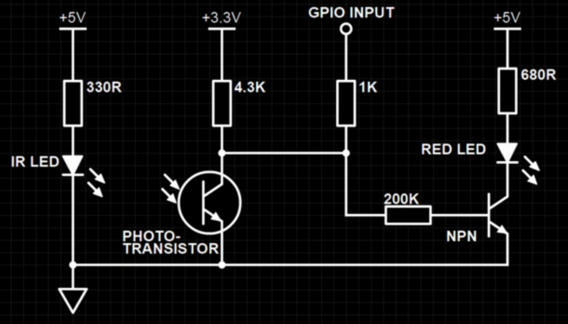

# Dommern

"Dommern", roughly translates to "The judge", is a timekeeping application for four individual racers around a circuit.

> We went car racing
> - Michael Masi

## Development
> Running this project on a Raspberry Pi requires giving the Docker instance privileged status, also persists the database data at `pgdata`.

### Backend
The backend is built with Spring Boot 3 and Java, using Gradle as build tool.
To start the development server locally, run:
```bash
./gradlew bootRun --args='--spring.profiles.active=local'
```
Timekeeping is then permitted on the keyboard, using the following keys:
`H`, `J`, `K`, `L` for lap times of racers 1 to 4 respectively.

The backend will be available at `http://localhost:8080` as default.

The backend in production mode can also be started with Docker using the provided `compose.yaml` file, 
as seen in the `compose.yaml` the application depends on a running instance of a PostgreSQL database.
```bash
docker compose up app
```
Timekeeping is then performed on the GPIO pins of the Raspberry Pi, using the folliwing pins:
`19`, `21`, `24`, `26` for lap times of racers 1 to 4 respectively.
Each pin should be connected to optical sensors for each racer.

### UI
The UI is built with Vite, Vue 3 and TailwindCSS.
To start the development server, run:
```bash
cd ui
npm run dev
```
The UI will be available at `http://localhost:5173/local` as default.
The production build is performed when running the gradle process `processResources`.
the msw (mock service worker) is only enabled when running in development.

## CI / CD
The project uses GitHub Actions for CI/CD.
On every release, a new version is built and published to GHCR as a Docker image,
buildt for ARM64 and AMD64 architectures.
The image is tagged with the release sha and `latest`.
And also deployed to a Raspberry Pi running in on our local racetrack.

## Error tracking
any thrown exception will be sent to the configured email address in production mode

## GPIO wiring

*the rightmost circuit shows the wiring of an optional indicator LED, which lights up when a lap is recorded.*

## GPIO pinout

*The different numbers and names for the GPIO pins on a raspberry pi5*
